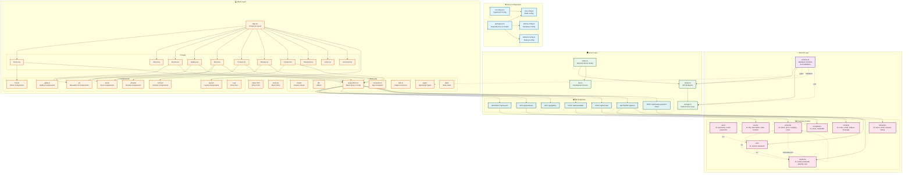

# Three Punch Convo

## Architecture

```mermaid

graph TB
%% Root Configuration
subgraph "🏗️ Root Configuration"
PKG[package.json<br/>Dependencies & Scripts]
TS[tsconfig.json<br/>TypeScript Config]
VITE[vite.config.ts<br/>Build Config]
DRIZZLE[drizzle.config.ts<br/>Database Config]
TAILWIND[tailwind.config.ts<br/>Styling Config]
end

%% Shared Layer
subgraph "🔄 Shared Layer"
SCHEMA[schema.ts<br/>Database Schema<br/>Zod Validation]

subgraph "📊 Database Entities"
USERS[users<br/>id, username, email, password]
EVENTS[events<br/>id, title, description, date, location]
PRODUCTS[products<br/>id, name, price, category, sizes]
NEWSLETTERS[newsletters<br/>id, email, createdAt]
CONTACTS[contacts<br/>id, name, email, subject, message]
CARTS[carts<br/>id, userId, sessionId]
CART_ITEMS[cartItems<br/>id, cartId, productId, quantity, size]
DONATIONS[donations<br/>id, name, email, amount, status]
end
end

%% Server Layer
subgraph "🖥️ Server Layer"
SERVER_INDEX[index.ts<br/>Express Server Setup]
ROUTES[routes.ts<br/>API Endpoints]
STORAGE[storage.ts<br/>Data Access Layer]
VITE_SERVER[vite.ts<br/>Development Server]

subgraph "🛣️ API Endpoints"
API_EVENTS[GET/POST /api/events]
API_PRODUCTS[GET /api/products]
API_GALLERY[GET /api/gallery]
API_NEWSLETTER[POST /api/newsletter]
API_CONTACT[POST /api/contact]
API_CART[GET/POST /api/cart]
API_PAYMENT[POST /api/create-payment-intent]
end
end

%% Client Layer
subgraph "💻 Client Layer"
CLIENT_INDEX[index.html<br/>Entry Point]
MAIN[main.tsx<br/>React Entry]
APP[App.tsx<br/>Router & Layout]

subgraph "📄 Pages"
HOME[Home.tsx]
ABOUT[About.tsx]
EVENTS_PAGE[Events.tsx]
GALLERY_PAGE[Gallery.tsx]
STORE_PAGE[Store.tsx]
PRODUCT_PAGE[Product.tsx]
DONATE_PAGE[Donate.tsx]
CONTACT_PAGE[Contact.tsx]
CHECKOUT_PAGE[Checkout.tsx]
LINKS_PAGE[Links.tsx]
NOT_FOUND[not-found.tsx]
end

subgraph "🧩 Components"
LAYOUT[layout/<br/>Layout Components]
UI[ui/<br/>Reusable UI Components]
STORE_COMP[store/<br/>Store Components]
GALLERY_COMP[gallery/<br/>Gallery Components]
HOME_COMP[home/<br/>Home Components]
CONTACT_COMP[contact/<br/>Contact Components]
DONATE_COMP[donate/<br/>Donate Components]
SVG[svg/<br/>SVG Icons]
end

subgraph "🔧 Client Utils"
HOOKS[hooks/<br/>Custom Hooks]
LIB[lib/<br/>Utilities]
QUERY_CLIENT[queryClient.ts<br/>React Query Config]
CONSTANTS[constants.ts<br/>App Constants]
UTILS[utils.ts<br/>Helper Functions]
TYPES[types/<br/>TypeScript Types]
DATA[data/<br/>Static Data]
end
end

%% Dependencies & Data Flow
SCHEMA --> ROUTES
SCHEMA --> STORAGE
ROUTES --> STORAGE
SERVER_INDEX --> ROUTES
SERVER_INDEX --> VITE_SERVER

%% Database Relations
USERS -.->|1:n| CARTS
CARTS -.->|1:n| CART_ITEMS
PRODUCTS -.->|1:n| CART_ITEMS
PRODUCTS -.->|self-reference| PRODUCTS

%% API to Database Entity Mapping
API_EVENTS --> EVENTS
API_PRODUCTS --> PRODUCTS
API_NEWSLETTER --> NEWSLETTERS
API_CONTACT --> CONTACTS
API_CART --> CARTS
API_CART --> CART_ITEMS
API_PAYMENT --> DONATIONS

%% Client to Server Communication
QUERY_CLIENT --> API_EVENTS
QUERY_CLIENT --> API_PRODUCTS
QUERY_CLIENT --> API_GALLERY
QUERY_CLIENT --> API_NEWSLETTER
QUERY_CLIENT --> API_CONTACT
QUERY_CLIENT --> API_CART
QUERY_CLIENT --> API_PAYMENT

%% Page to Component Relationships
APP --> HOME
APP --> ABOUT
APP --> EVENTS_PAGE
APP --> GALLERY_PAGE
APP --> STORE_PAGE
APP --> PRODUCT_PAGE
APP --> DONATE_PAGE
APP --> CONTACT_PAGE
APP --> CHECKOUT_PAGE
APP --> LINKS_PAGE
APP --> NOT_FOUND

%% Component Dependencies
HOME --> HOME_COMP
EVENTS_PAGE --> UI
GALLERY_PAGE --> GALLERY_COMP
STORE_PAGE --> STORE_COMP
STORE_PAGE --> UI
PRODUCT_PAGE --> STORE_COMP
DONATE_PAGE --> DONATE_COMP
CONTACT_PAGE --> CONTACT_COMP

%% Client Utils Dependencies
APP --> LAYOUT
HOME --> QUERY_CLIENT
EVENTS_PAGE --> QUERY_CLIENT
GALLERY_PAGE --> QUERY_CLIENT
STORE_PAGE --> QUERY_CLIENT
PRODUCT_PAGE --> QUERY_CLIENT
DONATE_PAGE --> QUERY_CLIENT
CONTACT_PAGE --> QUERY_CLIENT

%% Configuration Dependencies
PKG --> VITE
PKG --> DRIZZLE
PKG --> TAILWIND
TS --> VITE

%% Shared Schema Usage
SCHEMA -.->|types| TYPES
SCHEMA -.->|validation| ROUTES
SCHEMA -.->|orm| STORAGE

%% Styling
classDef config fill:   #e1f5fe,stroke:#01579b,stroke-width:2px
classDef shared fill:   #f3e5f5,stroke:#4a148c,stroke-width:2px
classDef server fill:   #e8f5e8,stroke:#1b5e20,stroke-width:2px
classDef client fill:   #fff3e0,stroke:#e65100,stroke-width:2px
classDef database fill: #fce4ec,stroke:#880e4f,stroke-width:2px
classDef api fill:      #e0f2f1,stroke:#004d40,stroke-width:2px

class PKG,TS,VITE,DRIZZLE,TAILWIND config
class SCHEMA,USERS,EVENTS,PRODUCTS,NEWSLETTERS,CONTACTS,CARTS,CART_ITEMS,DONATIONS shared
class SERVER_INDEX,ROUTES,STORAGE,VITE_SERVER,API_EVENTS,API_PRODUCTS,API_GALLERY,API_NEWSLETTER,API_CONTACT,API_CART,API_PAYMENT server
class CLIENT_INDEX,MAIN,APP,HOME,ABOUT,EVENTS_PAGE,GALLERY_PAGE,STORE_PAGE,PRODUCT_PAGE,DONATE_PAGE,CONTACT_PAGE,CHECKOUT_PAGE,LINKS_PAGE,NOT_FOUND,LAYOUT,UI,STORE_COMP,GALLERY_COMP,HOME_COMP,CONTACT_COMP,DONATE_COMP,SVG,HOOKS,LIB,QUERY_CLIENT,CONSTANTS,UTILS,TYPES,DATA client
class USERS,EVENTS,PRODUCTS,NEWSLETTERS,CONTACTS,CARTS,CART_ITEMS,DONATIONS database
class API_EVENTS,API_PRODUCTS,API_GALLERY,API_NEWSLETTER,API_CONTACT,API_CART,API_PAYMENT api
```
