# 3PunchConvo Architecture

## Overview

**3PunchConvo** is a specialized **MMA (Mixed Martial Arts) forum platform** built for fight discussion, polls, media sharing, and community engagement. Built with React SPA, Express.js API, PostgreSQL database, and **Clerk authentication**.

## Key Implementation Details

### 🏗️ Architecture Pattern

- **Client**: Single Page Application (React + Vite)
- **Server**: Express.js REST API (NO SSR - fully client-rendered)
- **Database**: **PostgreSQL with Drizzle ORM** (properly implemented)
- **Authentication**: **Clerk** for external auth + local user management
- **File Storage**: **AWS S3** for images/media
- **State Management**: React Query for server state

### 🥊 Core Business Domain - MMA Forum

```mermaid
flowchart TD
    subgraph "🌐 Client Layer (SPA)"
        UI[React Components<br/>Forum UI]
        RQ[React Query<br/>Server State]
        Auth[Clerk Auth<br/>User Authentication]
    end

    subgraph "🔄 Data Flow"
        API[REST API<br/>Express Routes]
        ClerkMiddleware[Clerk Middleware<br/>requireAuth]
        LocalUser[Local User Mapping<br/>Clerk to Local DB]
    end

    subgraph "🖥️ Server Layer"
        Routes[Express Routes<br/>Forum APIs]
        Storage[DatabaseStorage<br/>PostgreSQL + Drizzle]
        S3[AWS S3<br/>Image Storage]
        ESPN[ESPN API<br/>MMA Event Data]
    end

    subgraph "📊 Forum Entities"
        User[User<br/>username, role, status, points]
        Thread[Thread<br/>title, content, category]
        Reply[Reply<br/>content, nested replies]
        Poll[Poll<br/>question, options, votes]
        Media[Media<br/>images, GIFs]
        Reaction[Reactions<br/>likes, dislikes, POTD]
        Notification[Notification<br/>mentions, follows, likes]
        Category[Category<br/>general, UFC, etc]
    end

    subgraph "🥊 MMA Integration"
        MMAEvent[MMA Event<br/>date, venue, organization]
        Fighter[Fighter<br/>name, record, image]
        Fight[Fight<br/>fighter matchups]
    end

    subgraph "👥 Social Features"
        Follow[Follow<br/>user relationships]
        UserRank[User Rankings<br/>points, status tiers]
    end

    %% Authentication Flow
    UI --> Auth
    Auth --> ClerkMiddleware
    ClerkMiddleware --> LocalUser
    LocalUser --> Routes

    %% Data Flow
    UI --> RQ
    RQ --> API
    API --> Routes
    Routes --> Storage

    %% External Services
    Routes --> S3
    Routes --> ESPN

    %% Entity Relationships
    User -.->|1:n| Thread
    User -.->|1:n| Reply
    User -.->|1:n| Follow
    Thread -.->|1:n| Reply
    Thread -.->|1:1| Poll
    Thread -.->|1:n| Media
    Thread -.->|1:n| Reaction
    Reply -.->|1:n| Reaction
    Poll -.->|1:n| PollOption[Poll Options]
    Category -.->|1:n| Thread
    MMAEvent -.->|1:n| Fight
    Fighter -.->|1:n| Fight
    User -.->|1:n| Notification

    classDef client fill:#e3f2fd,stroke:#1976d2
    classDef server fill:#e8f5e8,stroke:#388e3c
    classDef entity fill:#fff3e0,stroke:#f57c00
    classDef mma fill:#f3e5f5,stroke:#7b1fa2
    classDef social fill:#e8f5e8,stroke:#388e3c
    classDef external fill:#ffebee,stroke:#d32f2f

    class UI,RQ,Auth client
    class Routes,Storage,ClerkMiddleware,LocalUser server
    class User,Thread,Reply,Poll,Media,Reaction,Notification,Category entity
    class MMAEvent,Fighter,Fight mma
    class Follow,UserRank social
    class S3,ESPN external
```



## 🥊 Forum-Specific Features

### User Status & Ranking System

```typescript
// User status progression based on activity
enum UserStatus {
  AMATEUR = "AMATEUR",
  REGIONAL_POSTER = "REGIONAL_POSTER",
  COMPETITOR = "COMPETITOR",
  RANKED_POSTER = "RANKED_POSTER",
  CONTENDER = "CONTENDER",
  CHAMPION = "CHAMPION",
  HALL_OF_FAMER = "HALL_OF_FAMER",
}

// Points-based ranking system
// - Posts, likes received, POTD (Post of the Day) awards
// - Automatic status calculation based on activity
```

### Thread & Discussion Features

- **Categories**: General, UFC, Boxing, etc.
- **Polls**: Embedded voting in threads with expiration
- **Media**: Image/GIF uploads to AWS S3
- **Reactions**: Like, Dislike, POTD (Post of the Day)
- **Nested Replies**: Threaded conversation support

### MMA Integration

- **Live Event Data**: ESPN API integration for fight schedules
- **Fighter Profiles**: Name, record, images
- **Event Discussions**: Dedicated threads for fight events

## 🔐 Authentication Architecture

### Dual Authentication System

```typescript
// External: Clerk handles authentication
// Internal: Local user management for forum features

// Flow:
// 1. User authenticates with Clerk
// 2. Clerk userId maps to local database user
// 3. Local user has forum-specific data (points, status, etc.)
// 4. ensureLocalUser middleware creates/syncs local user
```

### Session Management

- **External Sessions**: Managed by Clerk
- **Database Sessions**: PostgreSQL session store
- **User Sync**: Automatic local user creation from Clerk profile

## 🗄️ Database Architecture

### PostgreSQL with Drizzle ORM

- **Real database persistence** (not in-memory)
- **Proper foreign key relationships**
- **Transaction support for complex operations**
- **Session storage in database**

### Key Tables & Relationships

```sql
-- Core forum entities
users (id, username, points, status, role)
threads (id, title, content, category_id, user_id)
replies (id, content, thread_id, user_id, parent_reply_id)
polls (id, question, thread_id, expires_at)
poll_options (id, text, poll_id, votes_count)

-- Social features
follows (follower_id, following_id)
thread_reactions (thread_id, user_id, type)
reply_reactions (reply_id, user_id, type)
notifications (user_id, type, related_user_id, thread_id)

-- MMA data
mma_events (id, name, date, organization, venue)
fighters (id, name, nickname, record)
fights (id, event_id, fighter1_id, fighter2_id)
```

## 🚀 Key Technical Decisions

### Frontend Architecture

- **No SSR**: Pure SPA with client-side routing
- **React Query**: Optimistic updates and caching for forum interactions
- **Clerk Components**: Pre-built auth UI components
- **Real-time Feel**: Optimistic UI updates for likes/reactions

### API Design

- **RESTful**: Standard CRUD operations for forum entities
- **Clerk Middleware**: Authentication on protected routes
- **File Uploads**: Multer + S3 for media handling
- **External APIs**: ESPN integration for MMA data

### Performance Optimizations

- **Pagination**: Threads and replies with offset/limit
- **Eager Loading**: Related data fetched with main queries
- **Image Optimization**: S3 CDN for fast media delivery
- **Caching**: React Query for client-side state caching

## 📋 Current Implementation Status

### ✅ Implemented Features

- User authentication (Clerk + local mapping)
- Thread creation with polls and media
- Nested reply system
- Reaction system (likes, dislikes, POTD)
- User ranking and status calculation
- MMA event integration
- File uploads to S3
- Notification system

### 🔧 Development Workflow

```bash
# Local development
npm run dev     # Starts both client and server
npm run build   # Production build
npm run check   # TypeScript checking
npm run db:push # Push schema changes to PostgreSQL
```

### Key Files for New Developers

- `shared/schema.ts` - Database schema and validation
- `server/storage.ts` - Database operations with Drizzle
- `server/routes.ts` - API endpoints with Clerk auth
- `server/auth.ts` - User mapping between Clerk and local DB
- `client/src/lib/queryClient.ts` - React Query configuration
